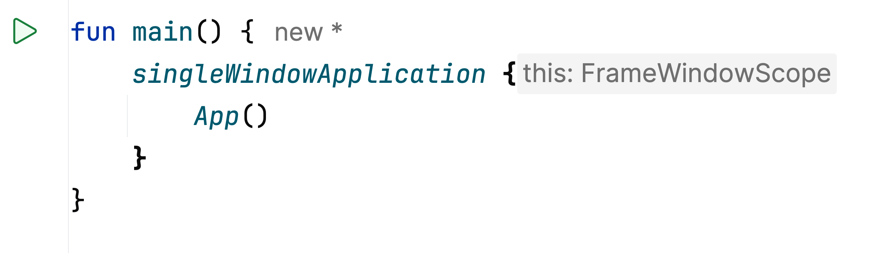

#  Compose Hot Reload

[](https://confluence.jetbrains.com/display/ALL/JetBrains+on+GitHub)

Iterate on your Compose UIs faster, and let your creativity run free when building multiplatform user interfaces.

<picture>
  <source media="(prefers-color-scheme: dark)" srcset="./readme-assets/banner_dark.png">
  
</picture>

Make changes to your UI code in a Compose Multiplatform application and see the results in real time. 
No restarts required.
Compose Hot Reload runs your application on the JetBrains Runtime 
and intelligently reloads your code whenever it is changed.

## Getting Started

### Requirements
- A Compose Multiplatform project with a desktop target (see [FAQ](#faq))
- Kotlin `2.1.20` or higher

### Apply the Gradle plugin to your project

Add the `org.jetbrains.compose.hot-reload` Gradle plugin to your build script:

```kotlin
plugins {
    kotlin("multiplatform") version "2.1.20" // <- Use Kotlin 2.1.20 or higher!
    kotlin("plugin.compose") version "2.1.20" // <- Use Compose Compiler Plugin 2.1.20 or higher!
    id("org.jetbrains.compose")
    id("org.jetbrains.compose.hot-reload") version "1.0.0-alpha11" // <- add this additionally
}
```

### Run the application
#### Multiplatform + IntelliJ
Using Kotlin Multiplatform and IntelliJ, launching your app is as simple as pressing 'run' on your main function:


#### Gradle Tasks
**Run Tasks**

The plugin will create the following tasks to launch the application in 'hot reload mode':
- `:jvmRunHot`: Multiplatform, async alternative (`jvmRunHotAsync`)
- `:runHot`: Kotlin/JVM, async alternative (`runHotAsync`)

**Arguments**

- `--mainClass <Main Class FQN>`:<br>
The main class to run.<br> 
_Example: `--mainClass com.example.MainKt`_


- `--autoReload <true|false>?` or `--auto`:<br>
Enable/disable automatic reloading. Default: `false`.<br> 
_Example: `--autoReload true`_<br>
_Example: `--auto`_

**Reload Task**

If the application was launched from CLI without the `--auto` option, 
then 'recompile + reloads' can be executed using the following task:
- `reload`: Generic task to reload all, currently running, applications.
- `hotReloadJvmMain`: Reload all applications that use the `jvmMain` source set.

The tasks 'mainClass' can be configured in the buildscript
```kotlin
tasks.withType<ComposeHotRun>().configureEach {
    mainClass.set("com.example.MainKt")
}
```

or provided when invoking the task
```shell
./gradlew jvmRunHot --mainClass com.example.MainKt
```

### Optimization: Enable 'OptimizeNonSkippingGroups' (Not Required):
Note: This optimization is not required, but will lead to a better user experience.
It is expected that the feature will be enabled by default in future versions of the compiler.

Add the following to your `build.gradle.kts`:

```kotlin
import org.jetbrains.kotlin.compose.compiler.gradle.ComposeFeatureFlag

// ...

composeCompiler {
    featureFlags.add(ComposeFeatureFlag.OptimizeNonSkippingGroups)
}
```

### Set up automatic provisioning of the JetBrains Runtime (JBR) via Gradle

> [!IMPORTANT]  
> To use the full functionality of Compose Hot Reload, your project **must** run on the JetBrains Runtime (JBR, an OpenJDK fork that supports enhanced class redefinition).

Gradle can perform the download and setup for the JBR automatically for you via [Gradle Toolchains](https://github.com/gradle/foojay-toolchains).

Add the following to your `settings.gradle.kts`:
```kotlin
plugins {
    id("org.gradle.toolchains.foojay-resolver-convention") version "0.10.0"
}
```
The Compose Hot Reload Gradle plugin will then use this resolver to automatically provision a compatible JDK.


## FAQ

### My multiplatform project doesn't have a Desktop target. Can I use Compose Hot Reload?

To use Compose Hot Reload, you'll have to add a module to your project that does configure a desktop target. It's worth noting that you will only be able to hot-reload code that can be run on the desktop JVM target. A possible setup might be the following:
- A `ui-components` module that specifies platform-agnostic UI components.
- A `gallery` module with a configured desktop target and Compose Hot Reload.

### I am developing an Android application and am not using Kotlin Multiplatform. Can I use Compose Hot Reload?

Compose Hot Reload is designed to work with Compose Multiplatform. If you'd like to use Compose Hot Reload with an Android-only project, you will have to:

- Switch from the Jetpack Compose plugin to the Compose Multiplatform plugin.
- Add a separate Gradle module and configure the `desktop` target according to the instructions above.

### My project is a desktop-only app with Compose Multiplatform. Can I use Compose Hot Reload?

Yes! However, please note that you can't start the application via the run button in the gutter ([CMP-3123](https://youtrack.jetbrains.com/issue/CMP-3123)). Instead, use the custom Gradle task as described above.


## Using 'dev' builds
The project publishes dev builds. To obtain the 'dev' Compose Hot Reload artifacts, first add the `firework` Maven repository:
In your projects' `settings.gradle.kts`, add the following:

```kotlin
pluginManagement {
    repositories {
        maven("https://packages.jetbrains.team/maven/p/firework/dev")
    }
}

dependencyResolutionManagement {
    repositories {
        maven("https://packages.jetbrains.team/maven/p/firework/dev")
    }
}

```
