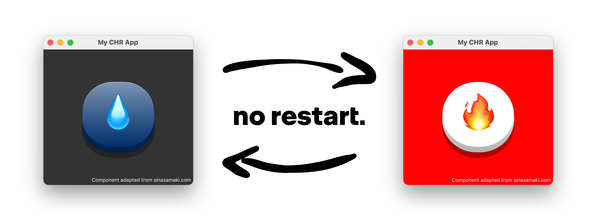

# 🔥 Compose Hot Reload

[](https://confluence.jetbrains.com/display/ALL/JetBrains+on+GitHub)

Iterate on your compose UIs faster, and let your creativity run free when building multiplatform user interfaces.

<picture>
  <source media="(prefers-color-scheme: dark)" srcset="./readme-assets/banner_dark.png">
  
</picture>

Make changes to your UI code in a Compose Multiplatform application, and see the results in real time. No restarts required. Compose Hot Reload runs your application on a special desktop JVM, and intelligently reloads your code whenever it is changed.  

**This project is currently experimental.** No guarantees apply.

## Getting Started

### Requirements
- A Compose Multiplatform project with a desktop target (see [FAQ](#faq))
- Kotlin `2.1.20-Beta2` or higher 

### Add repository
The project publishes experimental builds. To obtain the Compose Hot Reload artifacts, first add the `firework` Maven repository:

In your projects' `settings.gradle.kts`, add the following: 

```kotlin
pluginManagement {
    repositories {
        maven("https://packages.jetbrains.team/maven/p/firework/dev")
    }
}

dependencyResolutionManagement {
    repositories {
        maven("https://packages.jetbrains.team/maven/p/firework/dev")
    }
}

```

### Apply the Gradle plugin to your project

Add the `org.jetbrains.compose.hot-reload` Gradle plugin to your build script:

```kotlin
plugins {
    kotlin("multiplatform") version "2.1.20-RC" // <- Use Kotlin 2.1.20-RC or higher!
    kotlin("plugin.compose") version "2.1.20-RC" // <- Use Compose Compiler Plugin 2.1.20-RC or higher!
    id("org.jetbrains.compose")
    id("org.jetbrains.compose.hot-reload") version "1.0.0-dev-65" // <- add this additionally
}
```

### Enable 'OptimizeNonSkippingGroups':

Add the following to your `build.gradle.kts`:

```kotlin
import org.jetbrains.kotlin.compose.compiler.gradle.ComposeFeatureFlag

// ...

composeCompiler {
    featureFlags.add(ComposeFeatureFlag.OptimizeNonSkippingGroups)
}
```

### Set up automatic provisioning of the JetBrains Runtime (JBR) via Gradle

> [!IMPORTANT]  
> To use the full functionality of Compose Hot Reload, your project **must** run on the JetBrains Runtime (JBR, an OpenJDK fork that supports enhanced class redefinition).

Gradle can perform the download and setup for the JBR automatically for you via [Gradle Toolchains](https://github.com/gradle/foojay-toolchains).

Add the following to your `settings.gradle.kts`:
```kotlin
plugins {
    id("org.gradle.toolchains.foojay-resolver-convention") version "0.8.0"
}
```
The Compose Hot Reload Gradle plugin will then use this resolver to automatically provision a compatible JDK.

### Provide an entry point for your UI to hot-reload

In the `desktop` source set of your project, add the following code to a file of your choice, e.g. `DevMain.kt`

```kotlin
package my.app

import androidx.compose.material.Text
import androidx.compose.runtime.Composable
import androidx.compose.ui.unit.dp
import androidx.compose.ui.window.WindowState
import androidx.compose.ui.window.singleWindowApplication
import org.jetbrains.compose.reload.DevelopmentEntryPoint

fun main() {
    singleWindowApplication(
        title = "My CHR App",
        state = WindowState(width = 800.dp, height = 800.dp),
        alwaysOnTop = true
    ) {
        DevelopmentEntryPoint {
            MainPage()
        }
    }
}

@Composable
fun MainPage() {
    Text("🔥") // Write your own code, call your own composables, or load an entire app.
    // Make changes, and see them live.
}
```

### Optional: Create a custom entry point to launch your hot application

In a regular Kotlin Multiplatform project, you can start your main function by pressing the run ▶️ gutter icon for your `main` function. If you prefer starting your application via a Gradle task, you can register

```kotlin
// build.gradle.kts
tasks.register<ComposeHotRun>("runHot") {
    mainClass.set("my.app.DevMainKt")
}
```

## FAQ

### My multiplatform project doesn't have a Desktop target. Can I use Compose Hot Reload?

To use Compose Hot Reload, you'll have to add a module to your project that does configure a desktop target. It's worth noting that you will only be able to hot-reload code that can be run on the desktop JVM target. A possible setup might be the following:
- A `ui-components` module that specifies platform-agnostic UI components.
- A `gallery` module with a configured desktop target and Compose Hot Reload.

### I am developing an Android application and am not using Kotlin Multiplatform. Can I use Compose Hot Reload?

Compose Hot Reload is designed to work with Compose Multiplatform. If you'd like to use Compose Hot Reload with an Android-only project, you will have to:

- Switch from the Jetpack Compose plugin to the Compose Multiplatform plugin.
- Add a separate Gradle module and configure the `desktop` target according to the instructions above.

### My project is a desktop-only app with Compose Multiplatform. Can I use Compose Hot Reload?

Yes! However, please note that you can't start the application via the run button in the gutter ([CMP-3123](https://youtrack.jetbrains.com/issue/CMP-3123)). Instead, use the custom Gradle task as described above.
